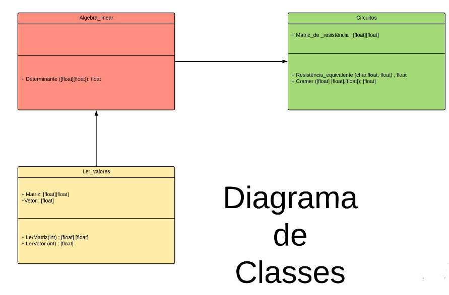
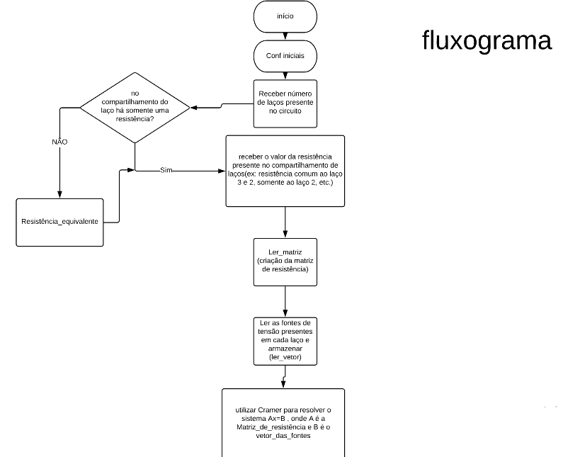
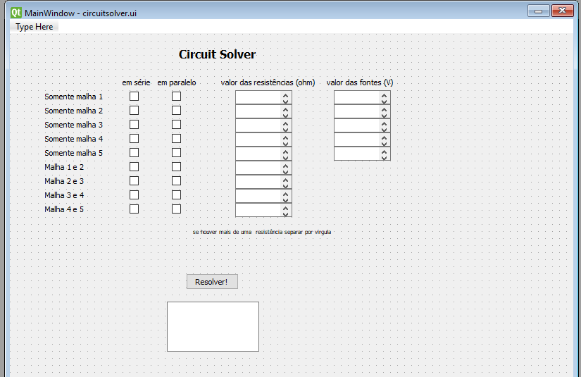
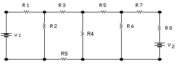

Vianna_CircuitsolverProjeto: Programa para solucionar circuitos do tipo laços
Por matrizes e método de cramer, assim podendo extender a resolução para n laços.

Motivação: Agilidade na resolução desse tipo de circuito para o cotidiano de um projetista.

"plus": tentar implementar não só o calculo do circuito com resistência mas também com impedâncias, sendo nescessário a implementação de resloução de sistemas lineares de variaveis complexas.

Diagrama de classe:

Fluxograma do algoritmo do programa.

Foi utilizado o seguinte tutorial:  http://pythonforengineers.com/your-first-gui-app-with-python-and-pyqt/

Assim escolhida a interface gráfica do projeto como pyQT, construimos um simples taxador de juros, impostos ou etc. o usuário entra com o valor inicial, com a porcentagem de taxa e recebe o valor final com taxa.

O programa final tem a seguinte interface gráfica:

Para utilizar o programa deve-se escolher um circuito de 5 laços com o formato dessa figura

onde tenha-se o valor das fontes de tensão e resistências. O programa devolverá a corrente em cada laço separado por ponto e virgula, como mostra o video do programa funcionando.

Para compilar o programa, deve colocar o codigo temp.py e cicuitsolver.ui na mesma pasta e compilar os mesmo com seu compilador python. Observe se a versão do python QT e do Python instalada em seu computador é condizente com a do código.

VIDEO DO PROGRAMA FUNCIONANDO 
https://drive.google.com/file/d/1x3WHWjAxq7UFjYAZTbpM-uDJlIDd9tYd/view?usp=sharing
