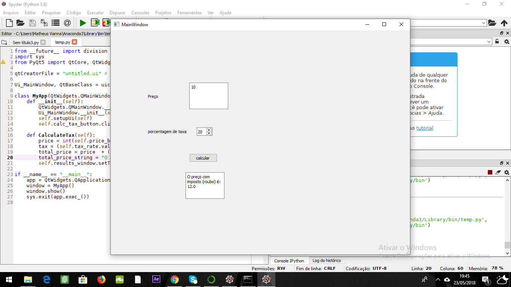

Vianna_CircuitsolverProjeto: Programa para solucionar circuitos do tipo laços
Por matrizes e método de cramer, assim podendo extender a resolução para n laços.

Motivação: Agilidade na resolução desse tipo de circuito para o cotidiano de um projetista.

"plus": tentar implementar não só o calculo do circuito com resistência mas também com impedâncias, sendo nescessário a implementação de resloução de sistemas lineares de variaveis complexas.

Foi utilizado o seguinte tutorial:  http://pythonforengineers.com/your-first-gui-app-with-python-and-pyqt/

Assim escolhida a interface gráfica do projeto como pyQT, construimos um simples taxador de juros, impostos ou etc. o usuário entra com o valor inicial, com a porcentagem de taxa e recebe o valor final com taxa.

No programa final "temp.py" tive o problema de referência dos botões com a interface gráfica o qual não consegui resolver. No código consta todos as etapas do algoritmo em questão nos comentários.

Atualização: O programa roda mas sem a funcionalidade do serie e paralelo
VIDEO DO PROGRAMA FUNCIONANDO 
https://drive.google.com/file/d/1x3WHWjAxq7UFjYAZTbpM-uDJlIDd9tYd/view?usp=sharing
